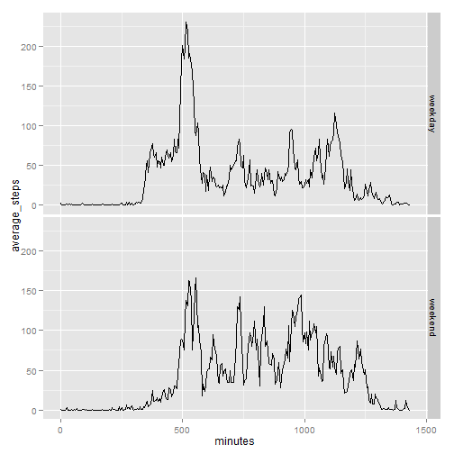

Reproducible Research: Peer Assessment 1
====


## Loading and preprocessing the data

```r
library(dplyr)
library(magrittr)
library(lubridate)
library(ggplot2)

unzip("activity.zip")
activity <- read.csv("activity.csv", stringsAsFactors = FALSE)
activity <- mutate(activity, date = ymd(date))
```


## What is mean total number of steps taken per day?


```r
steps_per_day <- activity %>% 
                 group_by(date) %>%
                 summarise(total_steps = sum(steps, na.rm = TRUE)) %>%
                 use_series(total_steps)


hist(x = steps_per_day)
```

 

```r
mean_steps <- mean(steps_per_day) %>% print
```

```
## [1] 9354.23
```

```r
median_steps <- median(steps_per_day) %>% print
```

```
## [1] 10395
```

The average number of steps taken per day is 9354.2295082 and the median number of steps taken per day is 10395

## What is the average daily activity pattern?


```r
steps_per_time <- activity %>%
                  group_by(interval) %>%
                  summarise(average_steps = mean(steps, na.rm = TRUE)) %>%
                  mutate(minutes = seq(from = 0, by = 5, along.with = interval))

#the minutes column is to have a proper x scale, without the jump from 55 to
#100. The interval is coded to mean 55 = 0h55min and 100 = 1h00min. But the
#difference between those points is 5, that's why I create a column with just 5
#units between each row.

plot(average_steps ~ minutes, data = steps_per_time, type = "l")
```

 

```r
#Note that I calculate the interval with max based on the original
#representation and not on the minutes
interval_with_max <- steps_per_time[[which.max(steps_per_time$average_steps), 
                                     "interval"]] %>%
                     print
```

```
## [1] 835
```

The 5 minute interval with the larger number of steps is the 835 interval.

## Imputing missing values

```r
rows_with_na <- sum(!complete.cases(activity)) %>% print
```

```
## [1] 2304
```

There are a total of 2304 rows with missing values.

There are several R packages that help with imputing missing values. However, lets keep it simple, as the instruction suggest.
First I thought taking the average of each day. However there are days without any value, which will have `NaN` as mean:


```r
average_steps_day <- activity %>%
                     group_by(date) %>%
                     summarise(average = mean(steps, na.rm = TRUE))

sum(is.nan(average_steps_day$average))
```

```
## [1] 8
```

So, instead lets take the average for the 5 minute interval:


```r
# We have already calculated the average steps per interval in a previous
# question

activity_no_na <- activity %>%
                  left_join(steps_per_time, by = "interval") 

#I wish I would find a way to do this with dplyr instead :(

for(i in seq_along(activity_no_na$steps)){
  activity_no_na$steps[i] <- ifelse(is.na(activity_no_na$steps[i]), 
                              activity_no_na$average_steps[i], 
                              activity_no_na$steps[i])
}

steps_per_day2 <- activity_no_na %>% 
                  group_by(date) %>%
                  summarise(total_steps = sum(steps, na.rm = TRUE)) %>%
                  use_series(total_steps)

hist(steps_per_day2)
```

 

```r
mean_steps2 <- mean(steps_per_day2) %>% print
```

```
## [1] 10766.19
```

```r
median_steps2 <- median(steps_per_day2) %>% print
```

```
## [1] 10766.19
```

When imputing missing values with the average of each day, the mean steps per day becomes 1.0766189 &times; 10<sup>4</sup>, which represents a increase from the case with missing values removed (9354.2295082). The median number of steps becomes 1.0766189 &times; 10<sup>4</sup>, which represents a increase, from the case with missing values removed (10395).


## Are there differences in activity patterns between weekdays and weekends?


```r
activity_no_na <- activity_no_na %>%
                  mutate(weekpart = wday(date)) %>% #from lubridate package, returns a number
                  mutate(weekpart = factor(ifelse(weekpart == 1 | weekpart == 7, 
                                                  "weekend", "weekday"))
                         )

steps_per_time <- activity_no_na %>%
                  group_by(weekpart, interval) %>%
                  summarise(average_steps = mean(steps, na.rm = TRUE)) %>%
                  mutate(minutes = seq(from = 0, by = 5, along.with = interval))

ggplot(steps_per_time, aes(x = minutes, y = average_steps))+
  geom_line()+facet_grid( weekpart ~ .)
```

 

